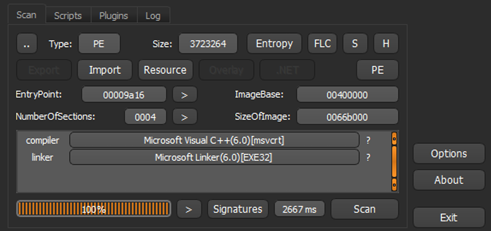
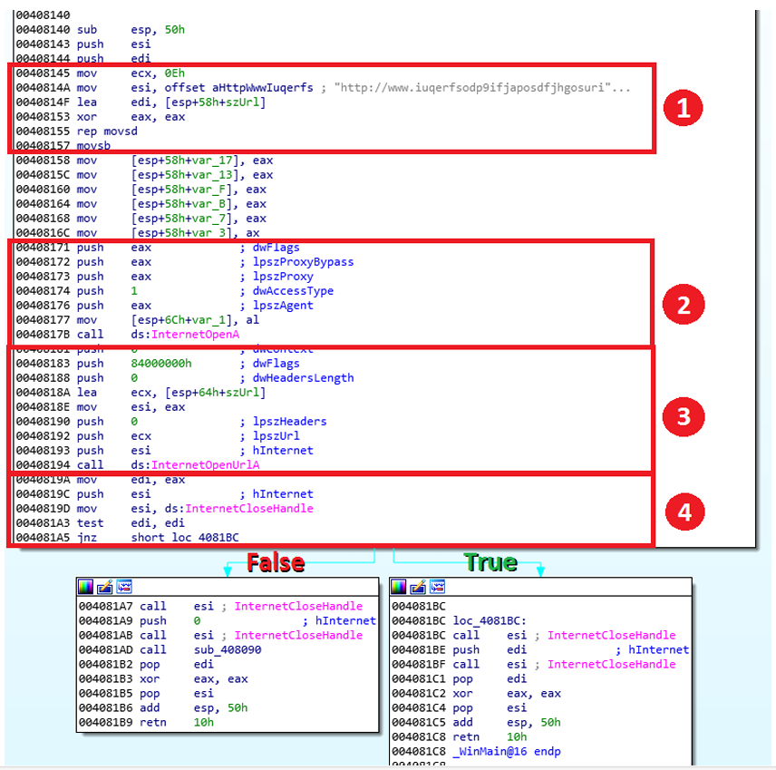
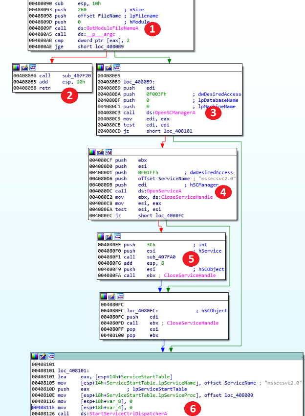
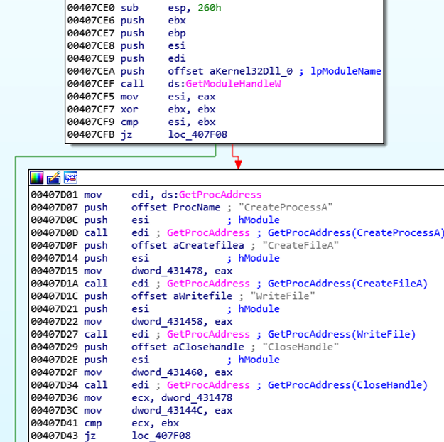
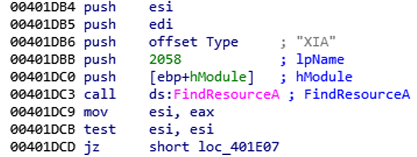
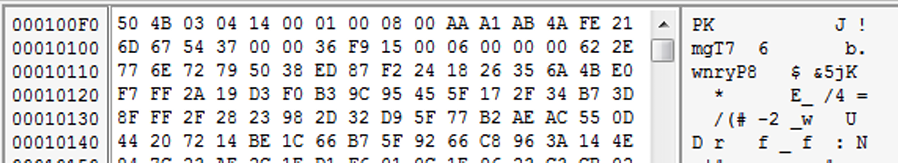

# Lazarus Group

## Terms and Processes 
- Aliases: Hidden Cobra, Zinc, APT-C-26, Guardians of Peace, Group 77, Who Is Hacking Team, Stardust Chollima, and Nickel Academy
- First apparition: 2009
- Last apparition: 2024-03-22
	- Malitious DLL used
	- MITRE ATT&CK Tactics and Techniques:
		- TA0002
		- TA0004
		- TA0007
		- TA0011

# News 
* [SANS ISC](https://isc.sans.edu/diary/Loader+activity+for+Formbook+QM18/30020)
* [The Hacker News Logo](https://thehackernews.com/2023/12/lazarus-group-using-log4j-exploits-to.html)
* [Twitter](https://twitter.com/IT_securitynews/status/1769003278379921892)

# Intrusion Campaigns
* [CVE-2024-21338](https://digvel.com/blog/lazarus-group-exploits-windows-zero-day-for-kernel-privileges/)
* [Healthcare](https://therecord.media/lazarus-new-malware-manageengine-open-source)
* 

## Operation Interception
  - Operation Interception - 2020 - Espionage campaign
  - Compromised domains:
	  -  fabianiarte.com
	  -  krnetworkcloud.org

## Operation North Star
- Operation North Star - 2020 - Espionage campaign
- Domain list:
  	- saemaeul.mireene.com
	- orblog.mireene.com
	- sgmedia.mireene.com
	- vnext.mireene.com
	- nhpurumy.mireene.com
	- jmable.mireene.com
	- jmdesign.mireene.com
	- all200.mireene.com

## Other campaigns: 
- Operation Flame
- Operation 1Mission
- Operation Troy
- DarkSeoul
- Ten Days of Rain
- Operation Blockbuster

# Third Party Intelligence 
  * [AlienVault](https://otx.alienvault.com/adversary/Lazarus%20Group) - **Date Received: 2024-01-17**
  * [Malpedia](https://malpedia.caad.fkie.fraunhofer.de/actor/lazarus_group) - **Date Received: 2024-02-07**
  * MISP - **Date Received: 2024-03-22**

# Known Malicious Tools 
- Responder
- DRATzarus
- Torisma
- Destover
- Malitious DLL files
- Customized dbxcli
- Malitious Office files
- Malitious XSL scripts to download next stage

## Exploits 
  - Responder - used for LLMNR, NBT-NS and MDNS poisoning, with built-in HTTP/SMB/MSSQL/FTP/LDAP rogue authentication server supporting NTLMv1/NTLMv2/LMv2, Extended Security NTLMSSP and Basic HTTP authentication.
  - Torisma - Used for Remode Desktop connections

## Implants 
- Malitious DLLs
- LNK files in startup folder
- Torism - Monitoring tool on victim's computer

## Utilities 
- Both Operation Interception and Operation North Star used most likely the same utilities, which is one more reason why they are called  Operation Dream Job as an umbrella term.
- The utilities:
  - Malitious DOCX files to run Macros
  - Used `regsvr32` to execute malware
  - Digitally signed their own malware to evade detection
  - *LinkedIn*  - phishing
  - *OneDrive*  and *OneDrive* - phishing links
  - **Themida** packer
  - `IsDebuggerPresent` call to detect debuggers
  - VBS and Powershell scripts
  - WMIC - Execute remote XSL script
  - delivered updates using HTTP and HTTPS requests
  - Wake-On-Lan combined with dbxcli to exfiltrate user's data on OneDrive

## Money:
Lazarus Group has been operation for more than 10 years, and according to U.S. officials, has stolen over 2$ bilion worth of cryptocurrency.
 - https://www.fbi.gov/news/press-releases/fbi-identifies-lazarus-group-cyber-actors-as-responsible-for-theft-of-41-million-from-stakecom
   
 - https://securityaffairs.com/150957/apt/lazarus-stole-240m-crypto-assets.html
   

	

## Timeline

## WannaCry Demo

MD5: db349b97c37d22f5ea1d1841e3c89eb4
SHA256: 24d004a104d4d54034dbcffc2a4b19a11f39008a575aa614ea04703480b1022c

### IoCs:
- http://www.iuqerfsodp9ifjaposdfjhgosurijarwrwergwea.com

### Behaviour:
1. 
Performs a request on the URL and if it fails, the main execution thread enters the `function wanna_cry_entr()`.
2. What is the compiler of the PE? 
 
3. What sections does this PE contain?
 - .text
 - .rdata
 - .data
 - .rsrc
4. What is the compiler timestamp value? 
**Sat Nov 20 11:03:08 2010**
5.  IDA displays the imported APIs and their respective modules inside the Imports window. 
 ● CryptAcquireContextA, CryptGenRandom indicate that the PE might be doing
 cryptographic actions; 
 ● CreateFileA, MoveFileExA, GetFileSize, ReadFile tell us that the process will 
 manipulate different files on the file system; 
 ● CreateServiceA,
 OpenServiceA,
 RegisterServiceCtrlHandlerA,
 StartServiceA, StartServiceCtrlDispatcherA, ChangeServiceConfig2, these
 are used to interact with Windows Services; 
 ● FindResourceA, LoadResource, SizeofResource are used to manipulate
 different attachments inside the PE binary; 
 ● GetAdaptersInfo, GetPerAdapterInfo acquires information about the network
 cards and their settings; 
 ● GetProcAddress will dynamically resolve the address of other functions from
 different modules; 
 ● InternetOpenA, InternetOpenUrlA can be used to open a web resource; 
 ● inet_addr, recv, send, socket, connect, WSAStartup can be used for network
 communication over different ports and protocols. 
 6. Do the embedded strings help you find OSINT about the file?
 - mssecsvc.exe
 - http[:]//www[.]iuqerfsodp9ifjaposdfjhgosurijfaewrwergwea.com
 - mssecsvc2.0
 - tasksche.exe
 7. Does the PE have any embedded file? 
The FindResource, LoadResource and LockResource Windows APIs indicate the use of embedded files and these functions help the programmer to easily grab a handle of the
resources.
8. Moving into the code:

    1. The URLis moved from one memory location to another using rep movsd
    2.  InternetOpenA will initialise the use WinInit library
    3.  InternetOpenUrlA will open an HTTP resource pointed at by the second argument
    4. Tests out the return value to see if the HTTP request was successful
     -  if the return is not equal to 0 (JNZ), it jumps on the True branch
     -  if the return is equal to 0, it will continue execution on the False branch 
    True: will close handles and will end/finish the process
    False: will close handles and will call the subroutine from 0x408090  
    Can you tell us why ? 
     
9. The subroutine from 0x00408090: 

- Fetches the full name of the process including the path on the disk and gets the number
 of arguments that were passed to the process. If the number of arguments is at least 2, it
 will jump on True branch, if not it will continue on the False branch
- Will call the subroutine from 0x407F20
- Establishes a connection to the service control manager on the specified computer and
 opens the specified service control manager database
- Fetches a handle to an existing service that can be used to interact with it
-  A call to the subroutine from 0x407FA0 is made and it also receives the handle to the
 service along with a second integer argument. This subroutine will change the service
 configuration
- This call indicates that the PE can run as a service, this API function specifies the
 service control subroutine that the service control manager will call. The service control
 subroutine is moved into a SERVICE_TABLE_ENTRY structure at 0x0040810E

 10. Subroutine from 0x00407CE0:
 
 In the first block of this subroutine, a call to GetModuleHandleW will get a handle of
 Kernel32DLL. The second block will dynamically resolve four Windows APIs using the
 GetProcAddress. GetProcAddress receives the Kernel32 handle along with the name of the
 API. The four APIs are CreateProcessA, CreateFileA, WriteFile, CloseHandle, the pointer to
 them will be returned in eax, then moved(saved) to a different location in memory.

 The code proves the fact that there are threads used to parallelize tasks.
 Also, contains a block of code which performs `Sleep` with `0x5265C00` as argument: 24h. 

#### Stage 2:
MD5: 84c82835a5d21bbcf75a61706d8ab549  
SHA-256: ed01ebfbc9eb5bbea545af4d01bf5f1071661840480439c6e5babe8e080e41aa  

1. Does any Windows API catch your attention? Why?
In addition to our first stage sample, the second stage imports several other APIs: 
 - **RegSetValueExA, RegQueryValueExA, RegCreateKeyW, RegCloseKey** are
 used to manipulate values inside the Windows Registry Hives
 - **CreateProcessA, TerminateProcess** are used to start and kill processes
 - **GetComputerNameW** will get the name of the infected machine
 - **OpenMutexAwill** return a handle to a synchronization object of type Mutex.
 - **CreateDirectory, CreateFile, GetFileAttributes, GetFileSize, ReadFile,
 SetFilePointer** enables interaction with files and directories from the file system

The embedded resource is located at 2058:
 
Based on the `magic number` it is a ZIP file. 
The password of the archive is **WNcry@2ol7**. 

## How does it spread ?
1. Generates a random IP address.
2. Performs an EternalBlue attack on the IP, which is an exploit of Microsoft's implementation of their Server Message Block (SMB) protocol.
https://en.wikipedia.org/wiki/EternalBlue

## What do these strings could mean?
 ● 13AM4VW2dhxYgXeQepoHkHSQuy6NgaEb94 
 ● 12t9YDPgwueZ9NyMgw519p7AA8isjr6SMw 
 ● 115p7UMMngoj1pMvkpHijcRdfJNXj6LrLn
